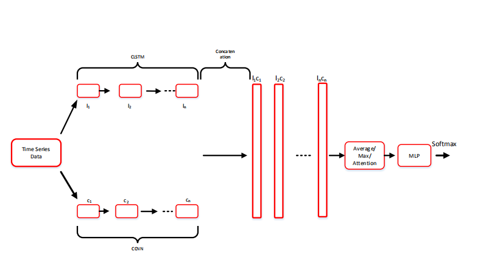

## Combining Contextual Neural Networks for Time Series Classification
This repository contains the architecture of our hybrid deep learning model. It is a well-tailored deep learning approach to effectively address the Time Series Classification (TSC) problem.

## Data
The datasets used in this project are obtained from the UCR time series archive.

## Table 1:  Test errors and mean of rankings for fourty-four ucr datasets.

| Dataset              | ResNet | FCN   | ITRD  | DTW_F | DATS  | LPS   | MCNN  | NTSC  | TSCD  | CNTC  |
| -------------------- | ------ | ----- | ----- | ------ | ----- | ----- | ----- | ----- | ----- | ----- |
| Adiac                | 0.406  | 0.243 | 0.241 | 0.312  | 0.23  | 0.383 | 0.255 | 0.153 | 0.184 | 0.142 |
| Beef                 | 0.366  | 0.132 | 0.366 | 0.266  | 0.199 | 0.132 | 0.286 | 0.249 | 0.232 | 0.286 |
| CBF                  | 0.003  | 0.001 | 0.002 | 0.001  | 0     | 0.01  | 0.009 | 0     | 0.006 | 0     |
| ChlorineCon          | 0.353  | 0.315 | 0.204 | 0.346  | 0.341 | 0.313 | 0.337 | 0.158 | 0.173 | 0.022 |
| CinCECGTorso         | 0.339  | 0.054 | 0.048 | 0.12   | 0.115 | 0.011 | 0.252 | 0.177 | 0.219 | 0.204 |
| Coffee               | 0      | 0     | 0.036 | 0.036  | 0     | 0     | 0.004 | 0     | 0     | 0     |
| CricketX             | 0.236  | 0.144 | 0.172 | 0.336  | 0.249 | 0.287 | 0.268 | 0.175 | 0.169 | 0.185 |
| CricketY             | 0.255  | 0.166 | 0.153 | 0.327  | 0.207 | 0.325 | 0.258 | 0.207 | 0.194 | 0.2   |
| CricketZ             | 0.245  | 0.127 | 0.141 | 0.312  | 0.245 | 0.276 | 0.262 | 0.186 | 0.186 | 0.211 |
| DiatomSizeR          | 0.034  | 0.083 | 0.024 | 0.037  | 0.047 | 0.07  | 0.127 | 0.071 | 0.07  | 0.017 |
| ECGFiveDays          | 0.232  | 0     | 0     | 0      | 0     | 0.055 | 0.183 | 0.015 | 0.045 | 0.057 |
| FaceAll              | 0.202  | 0.115 | 0.245 | 0.251  | 0.22  | 0.257 | 0.244 | 0.081 | 0.176 | 0.192 |
| FaceFour             | 0.17   | 0.091 | 0     | 0.034  | 0     | 0.034 | 0.051 | 0.068 | 0.068 | 0.088 |
| FacesUCR             | 0.085  | 0.047 | 0.053 | 0.093  | 0.032 | 0.069 | 0.08  | 0.042 | 0.032 | 0.064 |
| 50words              | 0.3    | 0.181 | 0.18  | 0.357  | 0.291 | 0.278 | 0.199 | 0.311 | 0.263 | 0.12  |
| fish                 | 0.187  | 0.039 | 0.061 | 0.027  | 0.021 | 0.067 | 0.09  | 0.039 | 0.021 | 0.011 |
| GunPoint             | 0.093  | 0.007 | 0     | 0      | 0     | 0.06  | 0.011 | 0     | 0.007 | 0     |
| Haptics              | 0.624  | 0.489 | 0.531 | 0.585  | 0.537 | 0.608 | 0.489 | 0.45  | 0.496 | 0.415 |
| InlineSkate          | 0.617  | 0.552 | 0.619 | 0.574  | 0.512 | 0.654 | 0.604 | 0.59  | 0.434 | 0.451 |
| ItalyPower           | 0.049  | 0.035 | 0.029 | 0.085  | 0.052 | 0.052 | 0.095 | 0.029 | 0.039 | 0.037 |
| Lightning2           | 0.13   | 0.163 | 0.163 | 0.261  | 0.147 | 0.097 | 0.256 | 0.196 | 0.245 | 0.24  |
| Lightning7           | 0.284  | 0.257 | 0.229 | 0.298  | 0.352 | 0.284 | 0.272 | 0.147 | 0.174 | 0.143 |
| MALLAT               | 0.056  | 0.026 | 0.047 | 0.054  | 0.003 | 0.082 | 0.027 | 0.01  | 0.011 | 0.005 |
| MedicalImages        | 0.263  | 0.258 | 0.26  | 0.474  | 0.288 | 0.305 | 0.269 | 0.208 | 0.228 | 0.215 |
| MoteStrain           | 0.165  | 0.085 | 0.079 | 0.115  | 0.073 | 0.051 | 0.135 | 0.055 | 0.105 | 0.06  |
| NonInvThorax1        | 0.21   | 0.093 | 0.064 | 0.169  | 0.161 | 0.174 | 0.138 | 0.039 | 0.052 | 0.043 |
| NonInvThorax2        | 0.135  | 0.073 | 0.06  | 0.118  | 0.101 | 0.118 | 0.13  | 0.045 | 0.049 | 0.049 |
| OliveOil             | 0.157  | 0.09  | 0.123 | 0.123  | 0.09  | 0.123 | 0.08  | 0.157 | 0.123 | 0.037 |
| OSULeaf              | 0.409  | 0.145 | 0.271 | 0.074  | 0.012 | 0.273 | 0.329 | 0.012 | 0.021 | 0.018 |
| SonyAIBORobot        | 0.275  | 0.146 | 0.23  | 0.265  | 0.321 | 0.238 | 0.175 | 0.032 | 0.015 | 0.042 |
| SonyAIBORobotII      | 0.159  | 0.066 | 0.06  | 0.178  | 0.088 | 0.056 | 0.186 | 0.028 | 0.028 | 0.03  |
| StarLightCurves      | 0.103  | 0.041 | 0.033 | 0.106  | 0.031 | 0.103 | 0.032 | 0.043 | 0.039 | 0.048 |
| SwedishLeaf          | 0.198  | 0.036 | 0.056 | 0.131  | 0.062 | 0.11  | 0.065 | 0.024 | 0.032 | 0.039 |
| Symbols              | 0.05   | 0.046 | 0.049 | 0.029  | 0.032 | 0.083 | 0.034 | 0.038 | 0.128 | 0.102 |
| SyntheticControl     | 0.007  | 0     | 0.003 | 0.04   | 0.03  | 0.033 | 0.008 | 0.01  | 0     | 0     |
| Trace                | 0      | 0.01  | 0     | 0      | 0     | 0.05  | 0.02  | 0     | 0     | 0     |
| TwoLeadECG           | 0      | 0.015 | 0.001 | 0.015  | 0.004 | 0.029 | 0.001 | 0     | 0     | 0     |
| TwoPatterns          | 0.096  | 0     | 0.002 | 0.001  | 0.016 | 0.048 | 0.046 | 0.103 | 0     | 0     |
| UWaveX               | 0.271  | 0.195 | 0.179 | 0.269  | 0.24  | 0.247 | 0.163 | 0.245 | 0.212 | 0.181 |
| UWaveY               | 0.365  | 0.266 | 0.267 | 0.363  | 0.312 | 0.321 | 0.248 | 0.274 | 0.331 | 0.29  |
| UWaveZ               | 0.342  | 0.265 | 0.232 | 0.336  | 0.312 | 0.346 | 0.217 | 0.271 | 0.245 | 0.278 |
| wafer                | 0.02   | 0.001 | 0.002 | 0.001  | 0.001 | 0.002 | 0.004 | 0.003 | 0.003 | 0     |
| WordSynonyms         | 0.361  | 0.276 | 0.286 | 0.449  | 0.355 | 0.367 | 0.312 | 0.43  | 0.378 | 0.224 |
| yoga                 | 0.154  | 0.103 | 0.102 | 0.159  | 0.071 | 0.149 | 0.139 | 0.145 | 0.132 | 0.062 |
| Score                | 3      | 7     | 6     | 4      | 10    | 4     | 3     | 13    | 8     | 18    |
| Percentage Score (%) | 7      | 16    | 14    | 9      | 23    | 9     | 7     | 30    | 18    | 41    |
| Mean of Rankings     | 7.727  | 4.712 | 4.977 | 7.114  | 4.023 | 7.182 | 7.53  | 3.932 | 4.5   | 3.136 |

## References
